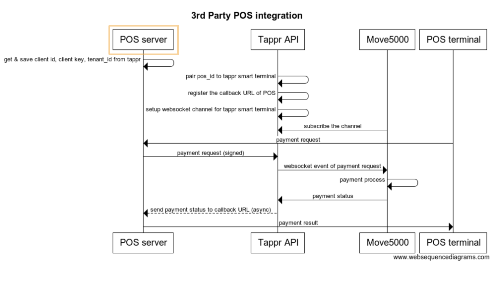

# Introduction

Welcome to the Tappr developer portal! 

Our API is organized around REST, and accetps form-encoded request bodies, with JSON-encoded response returned. We follow the standard HTTP response codes and verbs.

# Environment
<aside class="notice">
If you have any enviromental or api questions, feel free to click <code> Ask a Question</code> on left.
</aside>

Host for Staging API Endpoints: [https://api.staging.tappr.io](<https://api.staging.tappr.io>)

# POS integration
This section gives a basic workflow about how to integrate your POS system to Tappr ecosystem, while the Tappr Smart-terminal plays as a payment device (a.k.a PinPad). For this stage, we only support 1 POS to 1 Tappr smart terminal mapping, we will extend the ability in the next stage.

You can view code examples in the dark area on the right.

## Workflow

<a href="images/tappr-three-party-workflow.png" target="_blank">Click here for the large version of chart</a>

## What information do I need from the Tappr merchant to integrate our POS system?

Ask the Tappr merchant to get the values for `client_id`, `client_key`, and `tenant_id` (default tenant id will be tappr tenant id if missing), these info will be used during authentication and sending the request to Tappr API.

## What information should I give to the Tappr merchant?

The `pos_id` (pos terminal id) and `callback_url` should be given to the Tappr merchant, so that Tappr merchant can set these values while they setup the POS integration in their account on the Tappr Dashboard.

## Authentication

### signature

> - Sorted parameters in JSON format

```json

{
	"client_id": "d076d78c-9fd1-4287-8b52-cd779c48dd48",
	"currency_code": "AU",
	"minor_units": 100,
	"pos_id": "pos_1234",
	"sign_method": "hmac_sha256",
	"sign_version": "1",
	"timestamp": 1553654797
}
```

> - Concatenated string

```shell
concated_string = "client_idd076d78c-9fd1-4287-8b52-cd779c48dd48currency_codeAUminor_units100pos_idpos_1234sign_methodhmac_sha256sign_version1timestamp1553654797"
```

> - Hash the concatenated string with `client_key` using `hmac_sha256`


```ruby
digest = OpenSSL::Digest.new('sha256')
sign = OpenSSL::HMAC.hexdigest(digest, client_key, concated_string)
```

> - Merge the sign into parameters

```json
{
	"client_id": "d076d78c-9fd1-4287-8b52-cd779c48dd48",
	"currency_code": "AU",
	"minor_units": 100,
	"pos_id": "pos_1234",
	"sign_method": "hmac_sha256",
	"sign_version": "1",
	"timestamp": 1553654797,
	"sign": "4445fe5f50095614a2a2f2c27ccf2b9f754446b81562a9fc2c110081020e1956"
}
```

> - Send to tappr api as json request, e.g. curl -d parameter.

```shell
curl -X POST https://api.staging.tappr.io/v1/pi/transactions \
     -H "Content-Type: application/json" \
     -H "Tenant-Id: 27fe01d3-ea58-4e3b-bbc4-a6757473c6ab" \
     -d '{
             "client_id":"d076d78c-9fd1-4287-8b52-cd779c48dd48",
             "sign_method":"hmac_sha256",
             "sign_version":"1",
             "timestamp":1553654797,
             "minor_units":100,
             "currency_code":"AU",
             "pos_id":"pos_1234",
             "sign":"4445fe5f50095614a2a2f2c27ccf2b9f754446b81562a9fc2c110081020e1956"
     }'
```


For security reason, Tappr requires a signature present on every request sent to tappr api. Here are the steps to get the value of `sign` for the step of **sending payment request** in above workflow.

Assume the `client_key` you get from tappr is: `932a87fb-f1fa-40b1-861a-2be0488d576d`

The steps to get the value of sign as following:


1. Sort the parameters by key in alphabetical order:
2. Concatenate them in `"keyvaluekeyvalue..."` pattern:
3. Hash the concatenated string with `client_key` using `hmac_sha256`
4. Merge the sign into parameters
5. Send to tappr api as json request, e.g. curl -d parameter.

## Transactions

### Create a transaction

> POST /v1/pi/transactions

> Request:

```shell
curl -X POST https://api.staging.tappr.io/v1/pi/transactions \
     -H "Content-Type: application/json" \
     -H "Tenant-Id: 27fe01d3-ea58-4e3b-bbc4-a6757473c6ab" \
     -d '{
             "client_id":"d076d78c-9fd1-4287-8b52-cd779c48dd48",
             "sign_method":"hmac_sha256",
             "sign_version":"1",
             "timestamp":1553654797,
             "minor_units":100,
             "currency_code":"AU",
             "pos_id":"pos_1234",
             "pos_reference":"pos_order_reference",
             "sign":"2d99bb821873910263863bfd64ba5d90027bb18936b9544454ad691c6569cf3e"
     }'
```

> Response:

```json
{
	"id":"cdf73e94-5d28-4ada-8990-520e16497fe4",
	"business_id":"21d1f8f4-a007-4181-9782-2e02eec29d0c",
	"integration_id":"fa7ae1f2-7f0a-4df5-85f3-5b95f61907d1",
	"device_id":"44a1acc8-7f35-4ea2-a0e2-f8fd41737054",
	"pos_id":"pos_1234",
	"pos_reference": "pos_order_reference",
	"status":"waiting",
	"version":"e01e4561371098a42f3ec5958cd6476c",
	"minor_units":100,
	"currency_code":"AU",
	"created_at":1553663382,
	"updated_at":1553663382
}
```

Create a transaction to take payment.
Refer to [Authentication](#authentication) to learn how to get the value of sign in request params.

If a transaction is created, the transaction object will be returned with status of waiting waiting for tappr smart terminal to complete the payment.

#### Parameter

Parameter | Type | Description
--------- | ------- | -----------
client_id | string | Get from Tappr merchant
sign_method | string | hmac_sha256
sign_version | string | 1
timestamp | int | Unix timestamp
currency_code | string | AU
pos_id | string | POS unique id
pos_reference | string | POS order reference
sign | string | See [Authentication](#authentication)


#### Error
Status | Body | Description
--------- | ------- | -----------
400 | {"error":"minor_units is missing, currency_code is missing, pos_id is missing"} | Required params missing
400 | {"error":"You have not integrated with Tappr"} | Can't find integration by client_id
400 | {"error":"You have not integrated with Tappr device"} | Can't find device by pos_id
400 | {"error":"There is no activated Tappr device"} | Device status is not activated
400 | {"error":"There is no online Tappr device"} | Device is offline

### Get notified of transaction result

```shell
curl -X POST http://example.com/notify \
     -H "Content-Type: application/json" \
     -d '{
             "client_id":"d076d78c-9fd1-4287-8b52-cd779c48dd48",
             "id":"cdf73e94-5d28-4ada-8990-520e16497fe4",
             "business_id":"21d1f8f4-a007-4181-9782-2e02eec29d0c",
             "integration_id":"fa7ae1f2-7f0a-4df5-85f3-5b95f61907d1",
             "device_id":"44a1acc8-7f35-4ea2-a0e2-f8fd41737054",
             "status":"approved",
             "minor_units":100,
             "currency_code":"AU",
             "version":"459e0b2b41fa475a2c2024e1be125601",
             "sign_method":"hmac_sha256",
             "sign_version":"1",
             "timestamp":1553654797,
             "sign":"ce7a6dd63912dc03b2389d5001e61e00865b2dca45d162ecdfe718dbd5c69676",
             "metadata":{}
     }'
```

We use the async way to get you notified about the payment result, for sending the result to the `callback_url` (**Note**: must be **https,** and the **query parameters** will be **ignored**)you registered with Tappr.

In general, the data-flow will be like this: After creating the transaction, Tappr API will broadcast to Tappr Device to process the payment. And Tappr Device will submit the payment result to update the transaction status(approved or declined). As soon as the transaction status updated, Tappr API will request the `integration.callback_url` to notify the POS system with the transaction object.

For example: your `integration.callback_url` : `https://example.com/notify`

Tappr will initialise the request on the right to your `callback_url`

The `metadata' is a json item, delete this field before sign


### Get a transaction

> GET /v1/pi/transactions/:id

> Request:

```shell
curl -X GET https://api.staging.tappr.io/v1/pi/transactions/cdf73e94-5d28-4ada-8990-520e16497fe4 \
     -H "Content-Type: application/json" \
     -H "Tenant-Id: 27fe01d3-ea58-4e3b-bbc4-a6757473c6ab" \
     -d '{
             "client_id":"d076d78c-9fd1-4287-8b52-cd779c48dd48",
             "sign_method":"hmac_sha256",
             "sign_version":"1",
             "timestamp":1553654797,
             "sign":"..."
     }'
```


> Response:

```json
{
	"id":"cdf73e94-5d28-4ada-8990-520e16497fe4",
	"business_id":"21d1f8f4-a007-4181-9782-2e02eec29d0c",
	"integration_id":"fa7ae1f2-7f0a-4df5-85f3-5b95f61907d1",
	"device_id":"44a1acc8-7f35-4ea2-a0e2-f8fd41737054",
	"pos_id":"pos_1234",
	"pos_reference": "pos_order_reference",
	"status":"waiting",
	"version":"e01e4561371098a42f3ec5958cd6476c",
	"minor_units":100,
	"currency_code":"AU",
	"created_at":1553663382,
	"updated_at":1553663382
}
```

The POS system can find a transaction by id.

#### Parameter

Parameter | Type | Description
--------- | ------- | -----------
client_id | string | Get from Tappr merchant
sign_method | string | hmac_sha256
sign_version | string | 1
timestamp | int | Unix timestamp
sign | string | See [Authentication](#authentication)

#### Error

Status | Body | Description
--------- | ------- | -----------
404 | {"error":"Transaction not found"} | The transaction is not found

### Update a transaction

> GET /v1/pi/transactions/:id

> Request:

```shell
curl -X GET https://api.staging.tappr.io/v1/pi/transactions/cdf73e94-5d28-4ada-8990-520e16497fe4 \
     -H "Content-Type: application/json" \
     -H "Tenant-Id: 27fe01d3-ea58-4e3b-bbc4-a6757473c6ab" \
     -d '{
             "client_id":"d076d78c-9fd1-4287-8b52-cd779c48dd48",
             "status":"cancelled",
             "version":"e01e4561371098a42f3ec5958cd6476c",
             "sign_method":"hmac_sha256",
             "sign_version":"1",
             "timestamp":1553654797,
             "sign":"..."
     }'
```

> Response:

```json
{
	"id":"cdf73e94-5d28-4ada-8990-520e16497fe4",
	"business_id":"21d1f8f4-a007-4181-9782-2e02eec29d0c",
	"integration_id":"fa7ae1f2-7f0a-4df5-85f3-5b95f61907d1",
	"device_id":"44a1acc8-7f35-4ea2-a0e2-f8fd41737054",
	"pos_id":"pos_1234",
	"pos_reference": "pos_order_reference",
	"status":"cancelled",
	"version":"d02efx61371098a42f3ec4958cd837ut",
	"minor_units":100,
	"currency_code":"AU",
	"created_at":1553663382,
	"updated_at":1553663382
}
```

#### Parameter

The POS system update the transaction status to `cancelled`(only supported cancelled).

Parameter | Type | Description
--------- | ------- | -----------
client_id | string | Get from Tappr merchant
status | string | Only supported `cancelled`
version | string | Get from transaction.version
sign_method | string | hmac_sha256
sign_version | string | 1
timestamp | int | Unix timestamp
sign | string | See [Authentication](#authentication)

#### Error

Status | Body | Description
--------- | ------- | -----------
404 | {"error":"The transaction is not found"} | The transaction is not found
400 | {"error":"The version is out of date"} | The version is out of date
400 | {"error":"Can't update status from #{old_status} to #{new_status}"} | Only can update status from pending to cancelled


